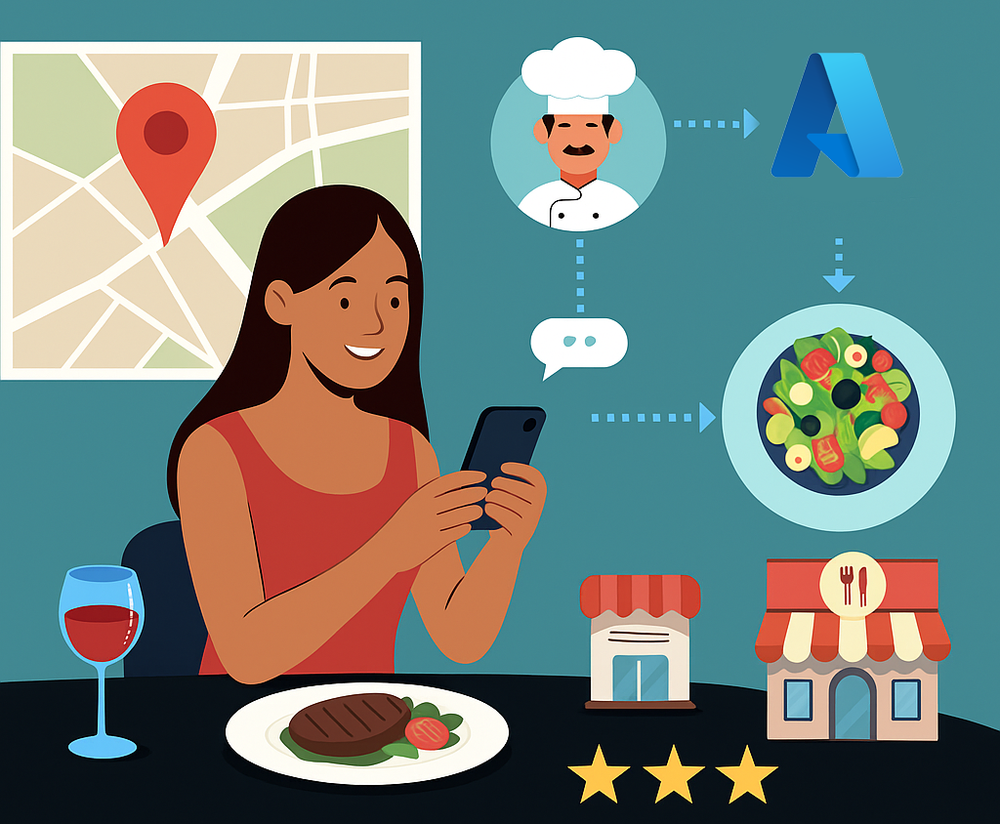
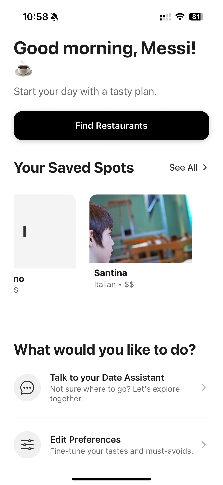
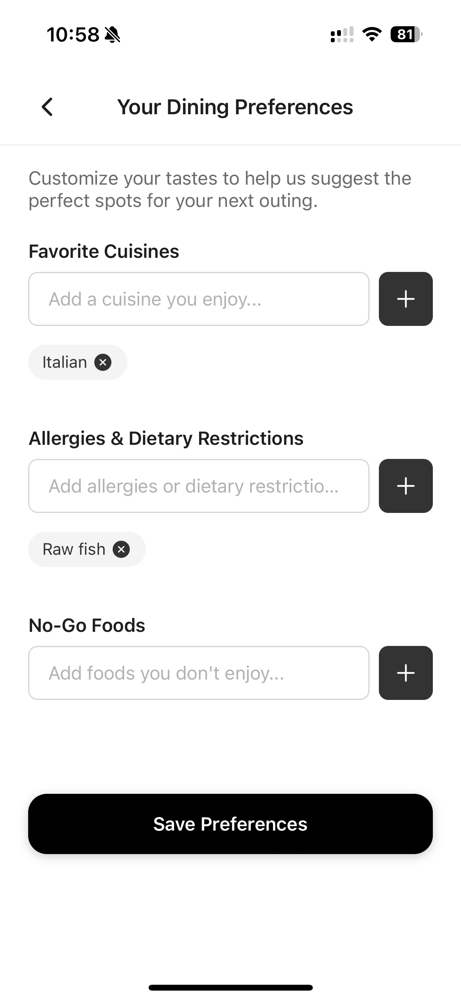
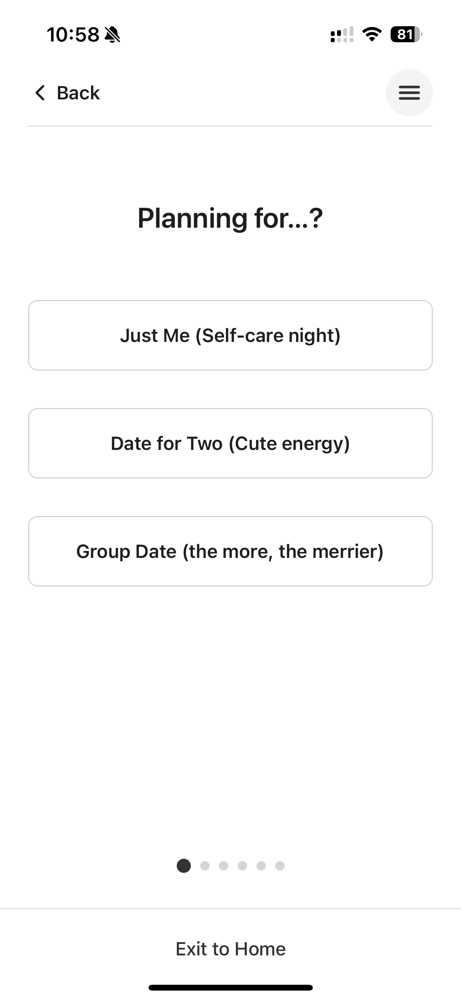
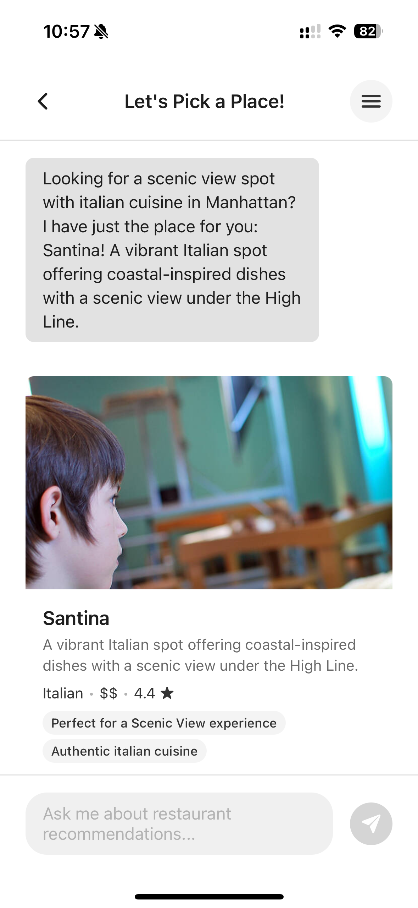
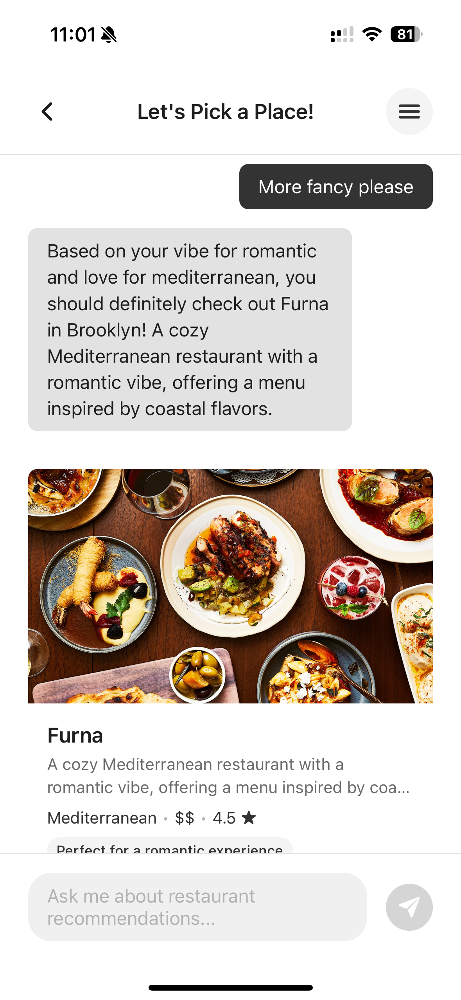
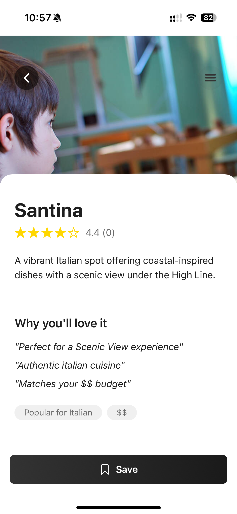

# DateMeal Mobile App - Full Stack Documentation
<p align="center">
  
</p>


---

## Project Overview

**DateMeal** is an AI-powered mobile application that helps users find ideal restaurants for a date by chatting with a personalized recommendation agent. The app tailors suggestions based on mood, ambience, budget, cuisine preferences, and dietary needs.

With a delightful onboarding experience, natural-language chat, and a sleek mobile UI, DateMeal guides users from selection to detail view—and even saves favorites. It uses Azure OpenAI (GPT-4o) to generate recommendations and optionally enriches them with real-world data via Bing Web Search Grounding.

---


## Why It's Innovative
- Uses **conversational AI** (Azure OpenAI) to recommend restaurants, instead of forms or filters.
- Supports **real-time refinement** via follow-up chat.
- Applies **Human-in-the-Loop design** for interactive, evolving suggestions.
- Augments AI responses with **Bing Web Search** for real-world accuracy and visuals.

---

## Responsible AI

- All AI-generated content is reviewed by the user before action—ensuring human oversight (Human-in-the-Loop).
- User preferences and past interactions are stored locally using AsyncStorage to preserve privacy.
- GPT-4o prompts are explicitly scoped to avoid biased, harmful, or sensitive content.
- The app avoids storing personal data in the cloud and includes fallback logic to ensure safety in the event of AI errors.


---

## Real-World Use Case

DateMeal solves a familiar but often frustrating problem: *“Where should we eat tonight?”* 

By offering personalized suggestions based on context (budget, mood, vibe, etc.) via natural conversation, it removes friction from decision-making. We envision this tool being used by:
- Couples planning a date night
- Groups deciding on dinner while traveling
- Users with dietary restrictions looking for safe dining options

The mobile-first, chat-based experience fits seamlessly into users’ lives—like having a restaurant-savvy friend in your pocket.


---

## Tech Stack

| Layer           | Technology                                  |
|----------------|----------------------------------------------|
| Mobile Frontend | React Native (Expo), TypeScript, Zustand     |
| Backend API     | FastAPI (Python), Azure OpenAI, Bing Search  |
| Storage         | AsyncStorage (local)                         |
| Hosting         | Azure App Service (Backend) + EAS (Frontend) |
| AI Services     | Azure OpenAI (GPT-4o), Bing Web Search        |
| Styling         | Custom theming + StyleSheet                  |

---

## System Architecture
```
User (Mobile App)
    ↓
React Native (Expo)
    ↓
FastAPI Backend (Azure App Service)
    ↓
Azure OpenAI (GPT-4o)
    ⇳ (optional) Bing Web Search Grounding
```
- The mobile client calls the FastAPI backend.
- The backend constructs a structured prompt, sends it to Azure OpenAI, and parses the structured JSON response.
- If available, the backend enriches results with real images and links via Bing Search API.


---

## Project Structure

### Frontend (`app/`)
```plaintext
app/
├── components/          # Reusable UI elements
├── navigation/          # Stack navigator
├── screens/             # Chat, Onboarding, Details, Home
├── services/            # API adapters (axios)
├── store/               # Zustand + AsyncStorage
├── theme/               # Style constants
├── types/               # Shared interfaces
├── utils/               # API base URL config, helpers
├── App.tsx              # Entry point
```

### Backend (`backend-python/`)
```plaintext
backend-python/
├── api/                 # API route handlers
│   ├── advise.py
│   ├── health.py
│   └── refine.py
├── models/              # Pydantic schemas
├── services/            # Azure OpenAI & Bing search wrappers
├── utils/               # Logger setup, etc.
├── main.py              # FastAPI app
├── requirements.txt     # Dependencies
├── .env                 # API keys and configs
```

---


## System Flow Overview

```
+--------------------+         +--------------------+
|  React Native App  |         |   AsyncStorage     |
|--------------------|         |--------------------|
| - User Onboarding  |<------->| - Preferences      |
| - Chat Interface   |         | - Cached Results   |
+--------+-----------+         +---------^----------+
         |                               |
         | HTTP Request                  |
         v                               |
+--------+-----------+         +---------+----------+
|       FastAPI      |         | Azure OpenAI (GPT) |
|--------------------|         |--------------------|
| - Receives input   |         | - Chat Completion  |
| - Formats prompt   |-------->| - Returns JSON     |
| - Handles fallback |         +--------------------+
+--------+-----------+                   
         |                                   
         v                                   
+--------------------+         +--------------------+
|  Bing Search API   |-------->|  Restaurant Data   |
|--------------------|         | (Structured JSON)  |
| - Image lookup     |         +--------------------+
| - URL enrichment   |
+--------------------+
```


---


## API Endpoints
| Method | Endpoint             | Purpose                                    |
|--------|----------------------|--------------------------------------------|
| GET    | `/health`            | Health check                               |
| POST   | `/advise`            | Generate restaurant recommendations        |
| POST   | `/restaurant/refine` | Refine a previous recommendation           |

---

## Key Frontend Features
- **Onboarding Flow**: Set preferences (mood, party size, cuisine, vibe, budget, allergies).
- **Chat Interface**: Converse with DateMeal AI Agent to discover ideal restaurants.
- **Restaurant Detail View**: Menus, hours, contact, map links.
- **Save for Later**: Saved restaurants displayed on home.
- **Offline Storage**: Preferences and past results stored via AsyncStorage.

---

## Key Backend Features
- **AI-Powered JSON Recommendations**: GPT-4o returns structured JSON.
- **Bing Enrichment (optional)**: Uses Bing Search API to add live URLs and photos.
- **Validation**: Strong schema enforcement with Pydantic.
- **Graceful Fallbacks**: If GPT fails, user still receives a static response.
- **CORS**: Enabled for Expo device access.

---


## Prompting Strategy

The backend sends a structured system prompt with examples, instructing GPT-4o to return exactly 3 restaurant recommendations in valid JSON format with specific fields such as:
- `name`, `description`, `cuisine`, `priceRange`, `rating`
- `menuItems` (array of dishes)
- `highlights`, `website`, `location`

> **Example System Prompt**:
>
> You are a restaurant recommender AI. Based on the following user preferences, return 3 diverse restaurant suggestions in strict JSON format.
> - Cuisine: Korean  
> - Budget: $$  
> - Mood: Cozy


It uses dynamic input from the user (e.g., "Romantic Italian in Brooklyn") to populate the prompt. If the response is malformed or missing, fallback handling is triggered.

---

## App Screens & Demo Walkthrough

<div align="center">
  
  <p><b>Home Screen</b>: Displays a greeting, shows saved restaurants and quick actions like chatting or editing preferences.</p>
</div>

<div align="center">
  
  <p><b>Preferences Page</b>: Update dietary restrictions, must-not-haves, and more to refine future results.</p>
</div>

<div align="center">
  
  <p><b>Onboarding Flow</b>: Users specify vibe, cuisine, party size, budget, dietary needs, and no-gos before receiving tailored results.</p>
</div>

<div align="center">
  
  <p><b>Chat Assistant</b>: Conversational UI lets users ask for suggestions and receive real-time responses from the AI agent.</p>
</div>

<div align="center">
  
  <p><b>Refine Recommendations</b>: After receiving suggestions, users can refine results by asking the agent to adjust based on new criteria.</p>
</div>

<div align="center">
  
  <p><b>Restaurant Detail View</b>: Expanded view of a selected restaurant, including highlights, contact info, hours, and curated menu.</p>
</div>


---

## Deployment

- **Backend**: Deployed to Azure App Service — [View Deployment](https://datemeal-backend-cga2d8fqfsctesh9.eastus2-01.azurewebsites.net/)
- **Frontend**: Published via Expo EAS Update — [Expo Dashboard](https://expo.dev/accounts/mxcao_alina/projects/DateMealMobile)

<p align="center">
  <br/>
  <em>Scan to preview the latest DateMeal app</em>
</p>


---


## Running Locally

### 1. Start Backend
```bash
cd backend-python
python3 -m venv venv
source venv/bin/activate
pip install -r requirements.txt
uvicorn main:app --reload --port 8001
```

### 2. Configure Frontend (for device testing)
Edit `utils/networkUtils.ts`:
```ts
const YOUR_COMPUTER_IP = '192.168.x.x';
```

### 3. Run Expo Frontend
```bash
npm install
npx expo start
```

Scan QR code to run on mobile or simulator.

---

© AI Agent Hackathon 2025 · Team: mxcaoalina, ziqun-liu, RajasekharwhY

